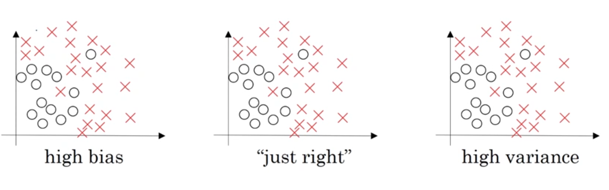
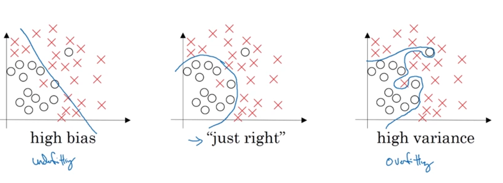
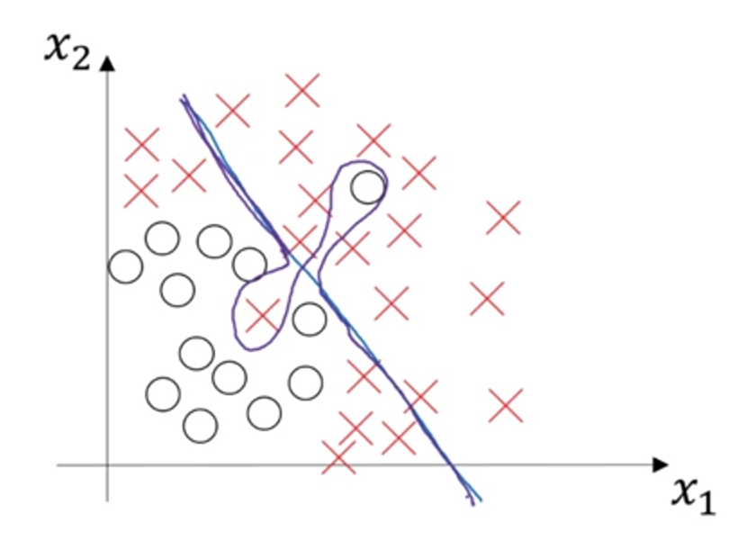

# Train / Dev / Test sets

When training model you will have some questions like:
- How many layers should I have?
- How many hidden units should I have in each layer?
- What learning rate should I pick?
- What activation functions should I use?
- ...

We will use a cycle to answer these questions:

```txt

    |------|    |-----|     |------------|
    | Idea | -> | Code| ->  | Experiment |
    |      |    |_____|     |            |
    |------| <------------  |------------|
            

```


```txt

[                     Training set                     |   Dev set   |   Test set   ]
```

The workflow:
1. Keep on training algorithms on the `training set`
2. Use your `dev set` (hold out cross validation set) to see which of many different models perform best on your `dev set `
3. Take the best model you have found and evaluate it on your `test set` in order to get an unbiased estimate of how well your algorithms is going

Common: 70%/30%/ or 60%/20%/20%
Bigdata: 98%/1%/1% or 99.5%/0.25%/0.25% or 99.5%/0.4%/0.1%

***Mismatched train/test distribution***
- **Make sure `dev` and `test` set come from same distribution** 

**`Test set` is not require:** because the `test set` is used to unbiased estimation. If you don't have to evaluate unbiased -> don't need the `test set`


# Bias / Variance




## Bias

High `bias` is the model not fit to the data. High bias is under-fitting. (Linear regression, ...)

## Variance

High `variance` is the model is too fit to the data. High variance is over-fitting. (Deep neural network, ...)

## Bias and Variance

In 2-dimensional feature like x1 and y2 problem, you can visualize data to see the `bias` and `variance` of the model. But in high-dimensional feature, you can't visualize the decision boundary.

So there're couple different metrics that we will look at to try to understand the `bias` and `variance` of the model.

The two key numbers to look at to understand `bias` and `variance` are:
- `Training error` 1%
- `Dev error` 11%
- Human error: 0%
-> The model is doing well on the `training set` but not on the `dev set` -> `over-fitting` -> `high variance`

- `Training error` 15%
- `Dev error` 16%: 16% 
- Human error: 0%
-> The model is not doing well on the `training set` and `dev set` -> `under-fitting` -> `high bias`

- `Training error` 15%
- `Dev error` 30%
- Human error: 0%
-> The model have high `training error` and high `dev error` -> `high bias` and `high variance`


- `Training error` 0.5%
- `Dev error` 1%
- Human error: 0%
-> The model is doing well on the `training set` and `dev set` -> `low bias` and `low variance`

>>> Note:
>>> Human error (Bayes error) is nearly 0%. 
>>> If optimal error (Human error or Bayes error) is much higher like 15%, training error is 15% and dev error is 16% we will not say the model `high bias` -> the model `low variance
>>> No model work perfectly. For example, if the image very blurry, so human can't recognize the image. The Bayes error is much higher.

## High Bias and High Variance

- Over-fitting a particular data set


# Basic Recipe for Machine Learning
